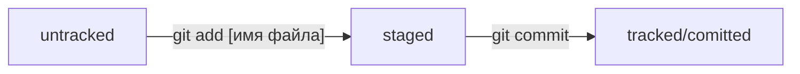

# Первый проект в курсе по Git от Яндекс Практикум
---

В проекте *добавлены* первые текстовые **файлы** и несколько коммитов по ним:
1. todo.txt
2. task.txt

Общая схема жизненного цикла изменений файлов и отслеживание их в Git:

